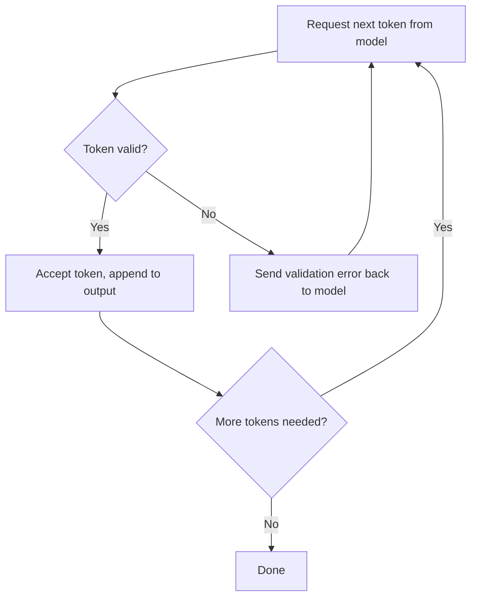

# How to guide your LLM to communicate with your system

Yes, LLM's are super great at chatting up a storm and like your favourite uncle at the grill it will make up a bunch of stuff on the spot with no real grounding. So I built a demo to show how to turn your favourite uncle into a IO factory.

I typed "give me all items that have name gadget and price 50" into a chat box wired up to a local model, and it came back with a clean, correctly-shaped JSON query. I ran it against the database. It worked. That took about an hour, and it felt like the whole problem — natural language in, structured query out, demo over and I just built a directed decoding prototype... No!

That hour got me maybe halfway. The rest of the project ([source on GitHub](https://github.com/dewwwald/article-artifact-directed-llm-output)) was spent on the half that doesn't show up in a demo: making sure the model's output isn't just *plausible* (something an inference statistical model is good at); instead, something a system can actually be trusted to run like an AST.

## The first draft

In my first draft I created an Agent loop that was very basic. Request the next character / token and if it is a valid token accept it and proceed to call next. If the token failed to validate pass the error back to the model until if gives you a valid next token.



## Plausible isn't the bar

When you chat with an LLM, you are the validator. If it says something slightly wrong, you notice, because you're a human reading human language and you have context it doesn't. That's general inference, and "pretty good most of the time". It gives you a statistically correct greeting when you ask it for one, or a statistically correct response to a job rejection email (oh I have seen a few ha). No emotion no understanding just correct statistics. This outcome is often an acceptable one, because a person is standing between the model and anything that matters is accounted for.

That's not what can happen when an autonomous system is interacting with a platform. That is what I was building at Mailchimp with our LLM segmentation experiment. I was building a query engine: natural language in, a structured filter out, and that filter gets executed against a database with nobody reading it first. In this scenario a person sounding off "looks about right" is no longer an option an LLM's output is consumed by code and run as if it is the gospel itself.

I actually cared about the end result: an enterprise system, where the data behind the query is something like PII. Now a wrong answer doesn't look like a bad chatbot reply. It looks like a filter that silently returns — or silently omits — records it shouldn't, because the model invented a field, or nested a condition wrong, or mapped "cost" onto a field that doesn't exist. Nobody reads the query before it runs, remember! The failure is systemic, not conversational.

That's the actual problem directed decoding is for.

## Building a grammar small enough to trust

Before any of that, I needed something to constrain the model *against*. So the project didn't start with the LLM at all — it started with a tiny, custom AST:

```
Node {
  operand: AND | OR
  action:  EQUALS | NOT_EQUALS | CONTAINS | NOT_CONTAINS
  path:    JSONPath-lite string, e.g. "$.items[]"
  value:   string
  then:    Node[]?
    (nested, applied per-element under a wildcard path)
}
```

An array of these nodes—just a rudimentary prototype. Each optionally nesting a `then` array of child nodes applied per-element when a path ends in a wildcard. Small enough to hold in my head, small enough to validate exhaustively, expressive enough to answer real questions against a real SQLite-backed dataset. I built the matcher and the persistence layer first, with no model anywhere near it, specifically so the grammar the LLM would eventually target was solid before I asked anything to generate it.

## Attempt one: hope disguised as validation

The first LLM integration was exactly the demo I described at the top. A plain-English description of the grammar as a system prompt:

```
Generate a JSON array of "Node" objects representing a search
AST. Respond with ONLY the JSON array: no prose, no code fences.

Each Node object has exactly these keys:
  "operand": "AND" | "OR"
    - combines this node with the previous one; always "AND"
      on the first node (never null, never omitted)
  "action": "EQUALS" | "NOT_EQUALS" | "CONTAINS" | "NOT_CONTAINS"
  "path": a JSONPath-like string, e.g. "$.name" or "$.items[]"
    - "[]" means "iterate every element"; use "then" to check
      fields on each element instead of chaining after "[]"
  "value": a string to compare against
  "then": optional; nested Node[] applied to each element when
    "path" ends in "[]"
```

Send the prompt, get a response, run it through `json.parseFromSlice`, and hope. When it worked, it looked exactly like real guided decoding — the output matched the grammar. When it didn't, the process crashed on a malformed field or just produced nonsense that happened to parse. You could at this point pass your context along with the errors from the LLM output and iterate until it succeeds. But there you are just adding that network IO latency per error and this is NOT guided decoding—but this is what I thought it was when I first learned about it. This was post-hoc validation. 

## Attempt two: actually constraining the model

Real constrained decoding steers generation at the token level — masking invalid next-tokens before they're ever produced — and a plain chat-completions call doesn't expose the logits you'd need to do that. Some model like the one I was running locally (Gemma, served through LM Studio) could really do token-level constraint. It could — LM Studio exposes `response_format: {type: "json_schema", ...}` on its OpenAI-compatible endpoint, and for MLX models it's backed by the [Outlines](https://github.com/dottxt-ai/outlines) library, which genuinely masks invalid tokens during sampling.

That meant writing a real JSON Schema — not the ad-hoc description I'd been hand-parsing against, but a document the *sampler* itself could enforce:

```json
{
  "type": "array",
  "items": { "$ref": "#/$defs/node" },
  "$defs": {
    "node": {
      "type": "object",
      "properties": {
        "operand": {
          "type": "string",
          "enum": ["AND", "OR"]
        },
        "action": {
          "type": "string",
          "enum": [
            "EQUALS", "NOT_EQUALS",
            "CONTAINS", "NOT_CONTAINS"
          ]
        },
        "path": { "type": "string" },
        "value": { "type": "string" },
        "then": {
          "anyOf": [
            { "type": "null" },
            {
              "type": "array",
              "items": { "$ref": "#/$defs/node" }
            }
          ]
        }
      },
      "required": [
        "operand", "action", "path", "value"
      ],
      "additionalProperties": false
    }
  }
}
```

Wired into the request body, this closed off an entire category of failure for free. Malformed JSON, a made-up key, an enum value outside `AND`/`OR` — structurally impossible now, not just checked-for-and-rejected after the fact.

By this point I'd also wrapped the whole pipeline in a small web UI — a chat pane next to a live diagram of Browser / Zig Server / LM Studio, with the request animated as it moves through each stage:

While playing around with this interface I found that the decoding was literal. What I needed was contextualized english looking for the correct nearest neighbor without hallucinating.

## Where meta data matters

While live testing a query that failed: "items that cost 50." Schema-valid JSON with every prompt. It was also useless — the model had nowhere to put "cost," because neither the AST's grammar doc nor the JSON Schema said one word about what the underlying *database* schema that the LLM was targeting. Both only describe the AST's own shape: operand, action, path, value, then. Nothing in either document says "and by the way, the field for amount of money is called `price`."

From a context engineering standpoint that mattered most in this whole project: **a schema constrains shape, not intent.** `additionalProperties: false` stops the model from inventing a key that isn't one of the five defined ones; the `enum` on `operand` separately stops it from writing a value outside `"AND"`/`"OR"` once that key exists. Two different mechanisms, both enforcing closed, checkable sets — and neither one can stop the model from confidently mapping "cost" onto a field that doesn't exist, because "cost means price" isn't a shape problem, it's a meaning problem—a nearest neighbor search problem. Put another way meaning isn't something a JSON Schema can validate.

The fix was a hint describing the real data model, generated by reflecting over the actual `Item` struct so it can never quietly drift out of sync with the code:

```zig
fn dataSchemaHint(allocator: std.mem.Allocator) ![]u8 {
    const fields = std.meta.fields(Item);
    // ...
    try w.writeAll(
        "The data being queried is {\"items\": [...]}, " ++
        "where each item has exactly these fields " ++
        "(no others exist): "
    );
    inline for (fields, 0..) |field, i| {
        if (i > 0) try w.writeAll(", ");
        try w.print("\"{s}\"", .{field.name});
    }
    try w.writeAll(
        \\. Map the user's wording onto exactly these
        \\field names, never a synonym (e.g. "cost" or
        \\"amount" both mean the "price" field).
    );
    // ...
}
```

Full function: [`zig/query.zig#L36-L78`](https://github.com/dewwwald/article-artifact-directed-llm-output/blob/1b8964bebfc534e6f907a43cc0d4f7630835eb6b/zig/query.zig#L36-L78)

That fixed "cost 50" — and broke something else. The hint's own example paths, `"$.name"` and `"$.price"`, read close enough to a literal template that the model started copying the bare field name instead of the JSONPath form: it would write `"price"` where the grammar needed `"$.price"`. The path resolver had no idea what to do with that and crashed the request outright. Same root cause as the first bug, one layer down — a mismatch between what I meant and what the model read, just moved from "which field" to "what does a path look like."

That's what prompt text actually is: an interface, consumed by something that never asks for clarification. Rewording it to fix one misreading can plant the seed of the next one, the same way tightening a contract for one caller can quietly break another. I fixed the wording — but wording is never provably complete, so I didn't stop there. I paired it with something sturdier: treating a bad path exactly like a bad token, retried through the same feedback loop instead of trusted and hoped for.

```zig
switch (try attemptOnce(
    allocator, io, bus, doc, prompt, schema.value
)) {
    .valid => |content| {
        // Schema-valid JSON can still be semantically
        // unusable — e.g. a path that doesn't start with
        // "$" or resolves against nothing. Treat that the
        // same as a validator rejection and retry, rather
        // than letting it crash the request.
        if (reportMatches(
            allocator, bus, rows, data, content
        )) |_| {
            return;
        } else |err| {
            reason = try std.fmt.allocPrint(
                allocator,
                "the query could not be run against " ++
                    "the data: {s}",
                .{@errorName(err)},
            );
            bad_content = content;
        }
    },
    .rejected => |r| {
        reason = r.reason;
        bad_content = r.content;
    },
}
```

Full function: [`zig/query.zig#L162-L179`](https://github.com/dewwwald/article-artifact-directed-llm-output/blob/1b8964bebfc534e6f907a43cc0d4f7630835eb6b/zig/query.zig#L162-L179)

That's the shape the "other 50%" actually takes in practice. Not a smarter model. A bounded retry loop that feeds the model the *specific, concrete reason* its last attempt failed, and asks it to correct exactly that — the same discipline you'd apply to any unreliable upstream dependency, applied here to a model instead of a flaky API.

## Trust, but verify — literally

Constrained decoding and the retry loop covered generation. Almost every other real bug in this project was caught the same way, and it wasn't by reading code and deciding it looked fine — it was by actually running it. A raw `curl` handshake and a Python `websocket-client` script surfaced a deadlock where the server's WebSocket handshake response wasn't being flushed. A real browser opening a page load and a WebSocket connection nearly simultaneously exposed a sequential accept-loop that could only ever service one of them. Live browser automation with the console open — not a glance at the rendered page — caught a frontend comparison against the wrong serialized shape of a Zig tagged union. Separately, it caught a stray unmatched parenthesis in a syntax-highlighting regex that silently broke the entire page script.

None of those were exotic bugs. All of them were invisible to a code read and obvious the moment something real touched the system. That's the same lesson I keep landing on with AI-assisted work generally: the plausible explanation for why something is behaving a certain way is not evidence, and neither is code that looks correct. Running, testing, and shipping outcomes is evidence.

## The takeaway

Directed decoding is necessary and it is not sufficient, and the distance between those two words was most of this project. Grammar-constrained sampling gives you something real: a guarantee that what comes back is structurally valid, which for anything you intend to execute against a live system is not optional. It does not give you a guarantee that the query means what your system needs it to mean — that a well-formed filter is also a filter that's right for your data. That gap doesn't close itself, and it's exactly the gap an enterprise system built on sensitive data can't afford to wave away as a rounding error. Closing it took a real data-aware hint, a retry loop that treats semantic failure as seriously as syntactic failure, and a lot of actually running the thing instead of trusting that it probably worked. Directed decoding was never going to hand me that part for free. That was always going to be the other 50 percent — mine to build, not the sampler's.
